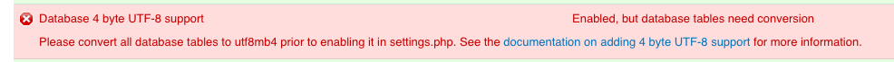

_Expectations:  It may take at least a minimum of **8 hours or more** to read this documentation and complete this installation, and depending on access to resources, may take several days. Please proceed slowly._
=======
## THIS SECTION OF DOCUMENTATION IS A WORK IN PROGRESS.

This Migration guide will help you migrate your existing production Islandora environment to an ISLE environment for easily maintaining Islandora. This guide will walk you through how to identify and copy your institution's Islandora data and files (including your data volume, Drupal site or sites, and commonly customized xml and xslt files) to your ISLE framework.

For additional help, please post a message to the [Islandora ISLE Google group](https://groups.google.com/forum/#!forum/islandora-isle). This [Glossary](../glossary.md) defines terms used in this documentation.

## Assumptions / Prerequisites

* You are comfortable with ISLE. We recommend first setting up the [Demo ISLE Site](../02_installation_demo_site/demo_installation.md) (`isle.localdomain`).

* You understand that all directions in this guide depend on the type of local computer used to connect via browser to Islandora. The instructions below assume a MacOS or Linux laptop or workstation to be used in conjunction with the ISLE Host Server for deploying configs, code, files etc. Windows users may have to adjust / swap out various tools as needed.

* A host server that conforms to the specifications outlined in - and has followed the appropriate setup and configuration instructions in - the [New ISLE Site section](../01_installation_host_server) of the guide.

* You have disk space on - or mounted to - the host server large enough to store a **copy** of your fedora data store

* You also have adequate storage space available for the ISLE host server to accommodate a working copy of a production Islandora's associated configurations and data.

* You have access to the ISLE host server from your local workstation via SSH as the `islandora` user with sudo privileges.

* You have a web domain name that works (i.e. is set up with a DNS entry you can make changes to if needed)

* You have [SSL Certificates](../glossary.md#systems) previously created for the web domain. (_Please work with the appropriate internal IT resource to provision these files for your domain_) OR: Use the [Let's Encrypt guide](../07_appendices/configuring-lets-encrypt.md) to generate and install SSL Certificates.

* You have cloned the ISLE repository to BOTH your local computer AND the ISLE host server

* You have access to the current Islandora production server(s)

* You have usernames and passwords for key parts of your current Islandora production environment which will be used **for** the migration. The next steps will walk you through finding this information.

    0. Login to your current Islandora production server. If your current production environment is located across multiple servers, you may need to check more than one server to find this information.
    1. To find your Drupal MySQL username, password, and database run the following command:
      * `grep --include=filter-drupal.xml -rnw -e 'dbname.*user.*password.*"' / 2>/dev/null`   
      * Example output:
         ```connection server="localhost" port="3306" dbname="**islandora**" user="**drupalIslandora**" password="**Kjs8n5zQXfPNhZ9k**" ```
         
         1. Username: copy the value from `user=`
         2. Password: copy the value from `password=`
         3. Database: copy the value from `dbname=`

    2. To find your Fedora MySQL username, password, and database run the following command:
      * `grep --include=fedora.fcfg -rnw -e 'name="dbUsername"' -e 'name="dbPassword"' -e 'name="jdbcURL"' / 2>/dev/null`
      * This command _will_ print multiple lines. The first three lines are important but please save the rest (just in case).
      * Example output:
          ```param name="dbUsername" value="**fedoraDB**"  
          param name="jdbcURL" value="jdbc:mysql://localhost/**fedora3**?useUnicode=true&amp;amp;characterEncoding=UTF-8&amp;amp;autoReconnect=true"  
          param name="dbPassword" value="**zMgBM6hGwjCeEuPD**"
         ```
         1. Username: Copy the value from `dbUsername value=`
         * Password: Copy the value from `dbPassword value=`
         * Database: Copy from the value `jdbcURL value=` the database name which is directly between the "/" and the only "?"

* You know where your Fedora, Drupal (Islandora), and Solr data folders are located.

   0. Login to your current Islandora production server. If your current production environment is located across multiple servers, you may need to check more than one server to located these data folders.

   1. Finding your Fedora data folder (common locations include `/usr/local/fedora/data` or `/usr/local/tomcat/fedora/data`):

        Run a find command: `find / -type d -ipath '*fedora/data' -ls  2>/dev/null`

   2. Finding your Drupal data folder (common location is under `/var/www/` likely in a sub-folder; e.g., html, islandora, etc.)

        Run a grep command: `grep --include=index.php -rl -e 'Drupal' / 2>/dev/null`

   3. Finding your Solr data folder (common location: `/usr/local/solr`, `/usr/local/tomcat/solr`, or `/usr/local/fedora/solr`)

        Run a find command: `find / -type d -ipath '*solr/*/data' -ls  2>/dev/null`

   4. Finding your FedoraGSearch data (i.e. transforms) folder

        Run a find command: `find / -type d -ipath '*web-inf/classes/fgsconfigfinal' -ls 2>/dev/null`

* You have a SQL dump (export) of the current production site's Drupal database. Ensure that the contents of any `cache` table are not exported.
    1. Login to your current Islandora production server and navigate to your Drupal data folder.

        Run the following command to generate a SQL dump of your Drupal database: `mysqldump -u {DRUPAL_USERNAME} -p {DRUPAL_DATABASE_NAME} | gzip > drupal.sql.gz`


**Finally also please note:** Instructions from this guide  and it's associated checklists call for you to **COPY** data from your current production Islandora environment to your ISLE Host Server or local computer. You work from these copies to build your ISLE environment. In some cases, you'll need to copy configurations down to your local computer (`Local ISLE config laptop`) and merge contents as directed. In other cases, due to the size of the data e.g. Fedora data you will copy directly to the ISLE Host server (`Remote ISLE Host server`). You will note where you have stored copies of files/data in a docker-compose.yml file. You will store your configured files in a git repository and use that to deploy to the ISLE host server.

## Detailed Steps

* Setup a Private Code Repository
      * Most of the work in this guide involves careful editing of the various configuration and settings files that customize the pieces of Islandora (database, repository, web-server, etc...).
      * Doing this work in a code repository makes it easier to correct errors and to repeat the process for additional servers without needing to replicate all the work.
      * Since the edits will include things like passwords, it's important to make this a private repository.

* Customizing for your Environment
      * Many of the steps below describe adding the domain name or other specific bits of information into files or appending those bits to file names.
      * In these cases this guide will call out the customization point AND provide an example - it's important not to literally copy paste the example!
      * Your best guide for these customizations are the source files from your currently running Islandora environment.

### Create Private Code Repository

**ON your local laptop / workstation:**

* On the repository of your choice (GitHub, GitLab, Bitbucket, etc.) create a PRIVATE remote git repository - see the specific code repository documentation online for setup instructions.

* Open a terminal - navigate to `/opt/ISLE` or where you cloned the ISLE directory on your local workstation.

* Create a directory named `yourdomain-config` (where "yourdomain" is your server domain name)

     * Example:  `digital-collections.yourdomain.com-config`

* Copy all the contents of the ISLE directory to the newly created directory

* `cd` into the newly copied and renamed `yourdomain-config` directory and type:

    * `git init`
    * _Initiates this directory as a code repository._

* Type: `git remote add NameOfYourRepository URLofYourRepository`

    * Connects your local repository to the remote you set up in the above steps.
    * **NOTE:** replace "NameOfYourRepository" and "URLofYourRepository" with the name of your repository and its URL

* You are now ready to perform the customization edits in this directory (you can use a text editor of choice now don't have to stay in terminal - just locate the folder in the finder and open file in text editor)


### Create Data Storage Directory

This area will be where all current Islandora production data is to be stored. This includes the Apache `/var/www/html` directory and the appropriate Fedora `/usr/local/fedora/data` subdirectories outlined below.

**ON your ISLE Host server:**

* Create a directory named `yourdomain-data` (where "yourdomain" is your server domain name)

    * Example:  `digital-collections.yourdomain.com-data`

* Ensure that the islandora user has ownership and permissions to access this data.

    * `chown -Rv islandora:islandora ~/digital-collections.yourdomain.com-data`

    * Please note this path may change depending on how your ISLE host server storage area is setup.

---

### Migration Export Checklist

* In the `/opt/ISLE/yourdoman-config` directory create a new sub-directory (you can call this `current_prod_islandora_config`)

* You will copy some files from your current Islandora Production server(s) into this directory following the [Migration Export Checklist](migration_export_checklist.md) and you will copy some files and folders directly to your ISLE host server (in case the data involved is too large for your local workstation) as directed in the checklist.

    * **Noting** most likely the Apache data (`/var/www/html`) & Fedora data (`/usr/local/fedora/data`) will be moved directly to your ISLE host server storage area and your new ISLE config files will be built on your local machine in the `current_prod_islandora_config` folder you just created.

* These copied files will be the source for edits and merges - just to be very clear, please **don't work directly on these files in your currently running production Islandora system!**

* To be even more clear, after following the checklist, you should now have two nearly identical `/config` subdirectories
    * **A.** copied from the cloned ISLE repository and renamed with your domain e.g. `yourdomain-config or digital-collections.yourdomain.com-config`
    * **B.** copied from your currently running Islandora environment. e.g. `current_prod_islandora_config`

### Migration Merge Checklist

The **goal** is to merge all site-specific data (domain names, variables, usernames, passwords, etc..) AND all site-specific customizations or settings from the files in directory B. into the matching files in directory A.

* Compare the data and settings of the files found within directory **B.** `current_prod_islandora_config`, and then merge, edit or copy as necessary with the templated settings found within the renamed directory **A.** `yourdomain-config` as guided in the [Migration Merge Checklist](migration_merge_checklist.md).

* Customizations: (_optional_) Carefully compare the following most frequently customized files with the new, default versions found within your new ISLE config folder. Use a "Diff" tool (example: [Beyond Compare](https://www.scootersoftware.com/download.php) to merge any desired customizations from your production Islandora files to persist within the new ISLE config folder of files:

   * Compare and merge the Solr files: `schema.xml`
   * Compare and merge the Solr files: `solrconfig.xml`
   * Compare and merge the Solr files: `stopwords`
   * Compare and merge the Fedora GSearch Islandora Transform (XSLTs) folder of files: `islandora_transforms`


### Docker .env File:
=======


* Edit the .env file and change the values of COMPOSE_PROJECT_NAME, BASE_DOMAIN, and CONTAINER_SHORT_ID. e.g. for a production site you may use:

    `COMPOSE_PROJECT_NAME=isleproduction`

    `BASE_DOMAIN=mydomain.edu`

    `CONTAINER_SHORT_ID=prod`

**Please note:** Much of the file is already with comments guiding the enduser to key areas or files to edit or modify accordingly.

---


## Final Steps

* Now that all the changes are made (be sure to save), ISLE should be ready to test. First you'll need to push these changes to your private code repository.

    * Open a terminal - `cd` to the config directory you've been making the changes in...

    * `git status`  this will show you all the files that have been modified and ready to be added to your private repository along with handy paths for the next steps.

    * `git add /pathtoyourmodifiedfile` (replace "pathtoyourmodifiedfile" with the path to your config directory)

    * run these:

    `git add apache`
    `git add fedora`
    `git add mysql`
    `git add proxy`
    `git add solr`
    `git add docker-compose.yml`

    * run `git status` again - everything should be in green now as all modified files have been added - if anything's still red use git add and the path to add it

    * then run `git commit -m "initial config commit"` inside the double quotes is the commit message you can say whatever you want in this message - so for example if this is the config for your dev instance you could say that...

    * run `git push origin master` this will push all your changes to the repository further changes should be made on branches for different servers or to master branch for this same server


--------

##Clone Custom Configuration to Host Server

* Open a terminal - ssh into your host server using the `islandora` user

* `cd` to `/opt/ISLE/config/`

* because your customizations are in a **private** repository, you'll need to add this islandora user's `id_rsa.pub` key to the repository via the website.

* This key is found in `/home/islandora/.ssh/id_rsa.pub`

* One can simply run `cat /home/islandora/.ssh/id_rsa.pub` and copy the output (ensure no whitespaces or extra returns)

* Go to the repository web site with a browser and locate your private repository.

      * locate the ssh key entry location (in Bitbucket this is in Settings / Access Keys /
      * **add** an ssh key w/ the label **islandora host server** paste in the key text and click **Add Key**

* Back at your terminal command line, run `git clone URLpathtoyourremoteprivaterepo.git .` (replacing "URLpathtoyourremoteprivaterepo" with the URL to the repository provided by the website)

* `cd` into the newly cloned directory - this is a good time to check that the ISLE directory contains your `yourdomain-config` directory and that it reflects all the edits and customizations.

## Spin Up ISLE Containers!

### Review or Pull Down ISLE Docker Images

_Please Note: You may have already done this in setting up the host server manually and / or with Ansible. However it is always a good idea to review and check using the first command below._

* Check if all ISLE images have been downloaded
  * `docker image ls`

  * If yes, then proceed to Step 7

  * If not, then pull the latest images:
    * `docker-compose pull`

---

### Spin Up the Proxy Container
=======


* `cd /opt/ISLE/yourdomain-config`
* `docker-compose up -d proxy`


### Spin up the MySQL Container and Import Production Database(s)

* `cd /opt/ISLE/yourdomain-config`
* `docker-compose up -d mysql`

Two methods for connecting to the MySQL Database (GUI / CLI) pick one.

1. One may use SQL GUI clients e.g. Sequel Pro, Navicat, PHPMyAdmin etc. and import the production Drupal website database(s)

2. If the above not practical, one may connect to the MySQL container and run the following.

    * `docker exec -it isle-mysql-institution bash` to connect to the container
        * swap out `institution` for the correct container name.
    * appropriate mysql commands here: consult MySQL documentation - https://dev.mysql.com/doc/refman/5.7/en/

2a. (_optional_) Only follow this if you have **not** first run `drush cc all` and then exported the MySQL databases or if you have **not** exported the MySQL databases excluding the contents of any table with `cache` in the name.

The following are STEPS, not literal commands to prepare your db for ISLE (_doing this because we've found there are errors using exported db from production because of caches - causes problems - steps below help you remove this problem_)

* import the production databases into the isle-mysql-institution container (_with errors being ignored_)
* truncate all tables that start with `cache` on the isle-mysql-institution container
* export this new database to the `mysql` directory on the isle host server
* delete all tables (_not the database itself_) on the isle-mysql-institution container
* Reimport the new lighter database to the isle-mysql container

---

### Spin up the Fedora Container and Start the Reindex Processes

Staying within `/opt/ISLE/yourdomain-config`
* `docker-compose up -d fedora`
    * _optional_ check if fedora is running properly e.g. `http://isle-prod-project.institution:8080/manager/html`
* `docker exec -it isle-fedora-institution bash`

* Follow the steps outlined in the [Migration Reindex Process Guide](migration_reindex_process.md)
    * Follow the steps outlined in the Reindex Fedora RI (1 of 3) section
    * Follow the steps outlined in the Reindex SQL database (2 of 3) section
    * Pause here before attempting the steps within the Reindex Solr (3 of 3) section.
    * Move onto the next section in this guide, `Spin up apache container`.

---

### Spin up Apache Container

* Staying within `/opt/ISLE/yourdomain-config`

* `docker-compose up -d apache`

* `docker exec -it isle-apache-institution bash`

*  Run the vset script
    * `cd /var/www/html`
    * `./vsets.sh`  

* Edit .htaccess to enforce https
    * `echo "SetEnvIf X-Forwarded-Proto https HTTPS=on" | tee -a /var/www/html/.htaccess`

* Check if the site is now is running properly by opening a web browser and navigating to your new ISLE domain e.g. `https://isle-prod-project.institution`

* Please note while you may be able to see objects being displayed, metadata and search results will be empty until you run the last step in the Reindex process.

**Troubleshooting Note** Sites migrating *from* a version of Drupal prior to 7.50 may need to update their mysql tables to utf8mb4.  On the new site, go to `https://isle-prod-project.institution/admin/reports/status` (you will need to be logged in as a Drupal Admin) and look for the following error:



Instructions for converting the Drupal mysql database are available on the [Drupal website](https://www.drupal.org/project/utf8mb4_convert)

---

### Spin Up Solr Container and Complete the Reindex Processes
=======

* Staying within `/opt/ISLE/yourdomain-config`
* `docker-compose up -d solr`
  * (_optional_) check if solr is running properly e.g. `http://isle-prod-project.institution:8777/manager/html`

* `docker exec -it isle-fedora-institution bash` **NOTE FEDORA NOT SOLR!**

* Follow the steps outlined in the [Migration Reindex Process Guide](migration_reindex_process.md)
    * Follow the steps outlined only in the Reindex Solr (3 of 3) section.
       * (_Ensure that Tomcat and Fedora are running._)

* Check the results on the site using Islandora simple search or the appropriate search method.

Congratulations you should have successfully migrated your production Islandora site to ISLE!!
